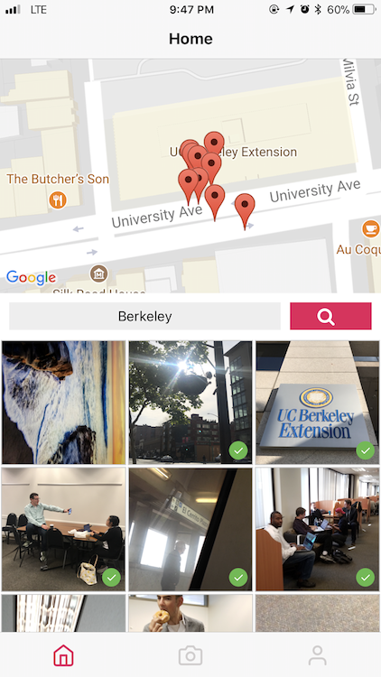
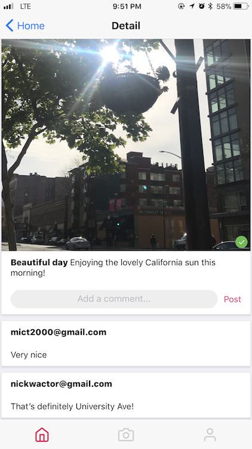
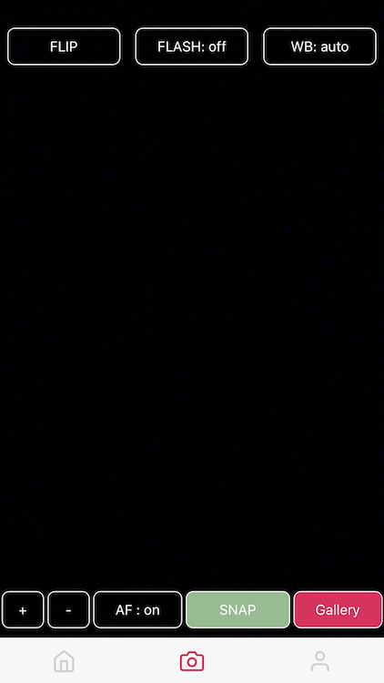
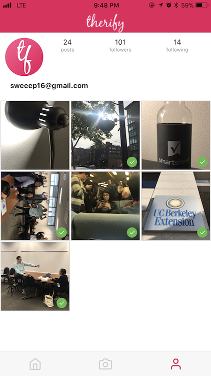

# Welcome to Therify

Therify is an app that was built by Denis Wu, Nick Wactor, Yusuf Mekias, Hillari Malle, Mike Thompson, and Vaibhav Tank.

The purpose of our app is to verify that a photo submitted by a user has been verified as authentic. Therify uses the GPS data along with the timestamps generated in the app at the time the photo was captured. Each photo will have a 'Therify' checkmark to provide users with a quick confirmation that our app recognizes it as a legitimate picture.

Technologies Used:
* React Native
* Expo XDE 
* mongoDB and mongoose 
* mLab and Heroku 
* NPM packages such as express, body-parser, socket-io, etc.
* Google Maps API / Google OAuth

## Use

To use Therify, you will need to download the Expo client app for your smart phone. Once you have it installed, on Android you can check out Therify by visiting https://expo.io/@vtank/therify and scanning the QR code there with your Expo app. iOS users ~~are SOL~~ will need to clone this repo and run it locally through Expo XDE in order to use the app.

Therify requires the user to login with a Google account.

## Install App Locally

Requirements: You will need node.js installed in your terminal and Expo XDE, which can be found here: https://docs.expo.io/versions/latest/introduction/installation 

1. Navigate to the directory where you would like to download Therify's files and run `git clone https://github.com/v-tank/therify.git`

2. `cd therify` `npm install`

### To Run:

1. Open Expo XDE and click `Open existing project...`, then give it the directory to which you cloned this repository.

2. Expo XDE will start the app. Once it has completed, hit the `Share` button to send the app to your phone.

## Backend Installation (Local Server and Database)

Keep reading if you'd like to run your own instance of the Therify server (you will have your own private photo and user database).

1. Create a new directory separate from the Therify app and run `git clone https://github.com/nwactor/therifybackend.git`
  (repository for backend code can be found here: https://github.com/nwactor/therifybackend)

2. `cd therifybackend` `npm install`

3.  Create a local mongoDB database called "therify". You will need to have mongo installed on your machine. 

4. Navigate to line 19 of server.js (located in the project's root directory) and replace the string in `mongoose.connect("<string>")` with `mongodb://localhost/therify`

5. Run the following command in your app directory to change the IP address in the files to get your server to connect to the front-end:
```find screens components -iname '*js' -exec sed -i  s/https\:\/\/therifyserver.herokuapp.com/<YOUR_LOCAL_IP_ADDRESS>/g {} +``` 
  i. To determine your IP address to place in the above command, use `ipconfig` on Windows or `ifconfig` on Mac/Linux. 


6. `node start` in your therifybackend directory (the one that contains server.js)

   

## Future Development

Features:
* Ability to upload videos
* In-depth Profile and Friends list
* Feed with world-wide and local happenings like news, protests, strikes, or other public gatherings where users can search their area and see if something exciting and worthy of instant verification is happening
* Ability to add universal hashtags
* Add “scheduled uploading” where a user can choose a specific time for the photo to be made public. User can take a photo at any time, but can choose when it will go live
* Ability to delete comments and photos
* Corresponding pin highlights on the map when a picture is chosen
* Better map features to dynamically change the radius of the searched photos based on the zoom level as well as their location on the map
* Rating system for photos so users can vote to add their own seal of therification
* Standalone Android and iOS apps
* Additional camera features to edit pictures before posting (cropping, orientation, filters, etc.)

Improvements: 
* Image load times
* UI/UX